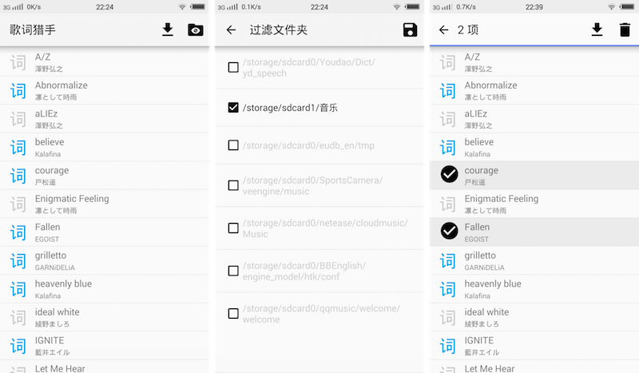

# LrcJaeger([Google Play](https://play.google.com/store/apps/details?id=orz.ludysu.lrcjaeger))

LrcJaeger - A lyrics batch downloader for Android, which is great for ACG songs. Focus on lrc searching and downloading, no any other function. 

歌词猎手 - Android用歌词批量下载软件，ACG动漫歌词非常齐全更新快，中文歌词也很全。专注歌词搜索与下载，无其他任何功能。 

## Update（更新信息）

- 2016-06-21: V1.4 release, small bug fixes
- 2015-10-16: V1.3 release, small bug fixes
- 2015-10-16: V1.2 release, Add multi choices and long click mode; more polished UI icons
- 2015-10-07: V1.1 release, major update in many aspects
- 2013-10-19: V1.0 release

## Features（功能）

<ol>
<li>Download all lyrics by ONE click</li>
<li>Hide the folders you don't want</li>
<li>View the content of lyric, and hide the time tag (only text)</li>
<li>Search for a lyric manually, download the version you want</li>
<li>Long click or touch "Lrc" icon to enter multi choice mode</li>
</ol>

<ol>
<li>一键下载所有歌曲歌词（优先下载“中日”双语歌词）</li>
<li>过滤不需要的文件夹</li>
<li>点击已下载项：浏览歌词内容，并可隐藏歌词时间轴</li>
<li>点击未下载项：搜索歌词，可选择你想要的版本</li>
<li>长按或点击“词”图标进入多选模式，批量删除、下载选中歌词</li>
</ol>

## Usage（源码使用）

Import the source folder into Android Studio and build & run. Or you can download the binary APK file below and get it run in your Android device right now.

把源码目录导入 Android Studio 并编译运行。或者下载下面的APK文件，可立即在你的Android设备上运行。

## Download（APK 下载）

latest release [APK from GitHub](https://github.com/LudySu/LrcJaeger/releases)

最新发布 [从 GitHub 下载 APK](https://github.com/LudySu/LrcJaeger/releases)

国内用户也可以用 [百度网盘下载 APK](http://pan.baidu.com/s/1sj22N6H#path=%252FLrcJaeger)

## Credits（鸣谢）

- Icons from opensource [Google Material Icons](https://www.google.com/design/icons/)

## License（许可）

    Copyright 2015 Ludy Su

    Licensed under the Apache License, Version 2.0 (the "License");
    you may not use this file except in compliance with the License.
    You may obtain a copy of the License at

       http://www.apache.org/licenses/LICENSE-2.0

    Unless required by applicable law or agreed to in writing, software
    distributed under the License is distributed on an "AS IS" BASIS,
    WITHOUT WARRANTIES OR CONDITIONS OF ANY KIND, either express or implied.
    See the License for the specific language governing permissions and
    limitations under the License.

For details see LICENSE.txt in root dir of source code

查看在源码根目录的 LICENSE.txt

